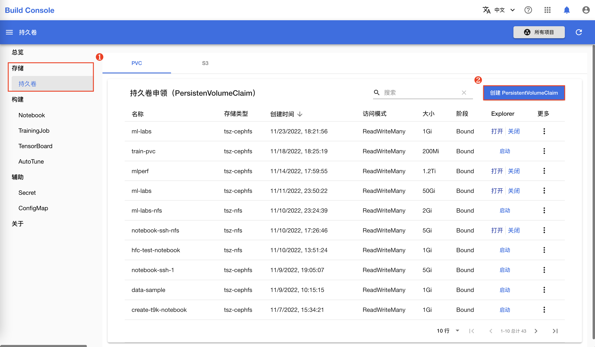
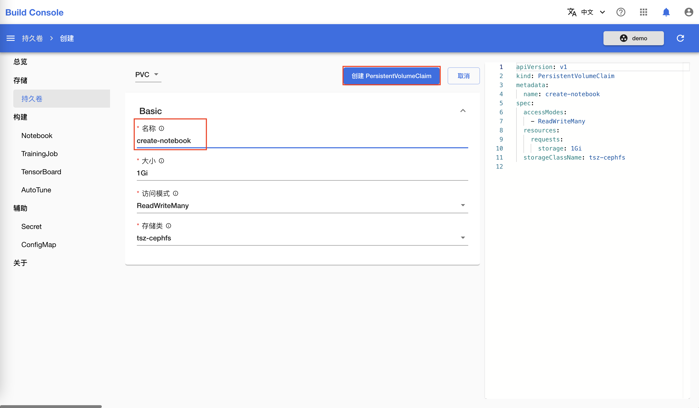
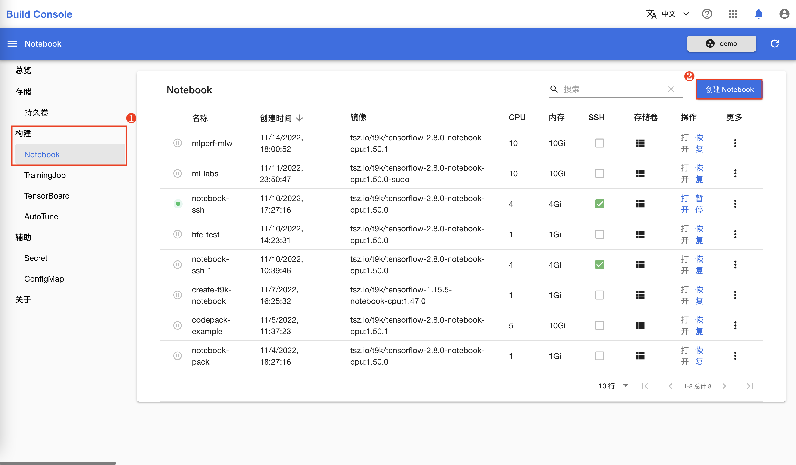
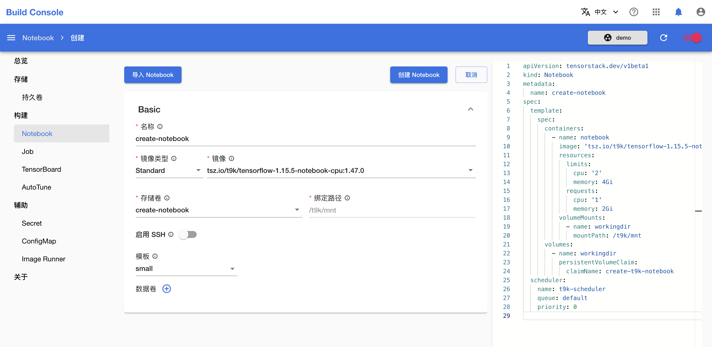
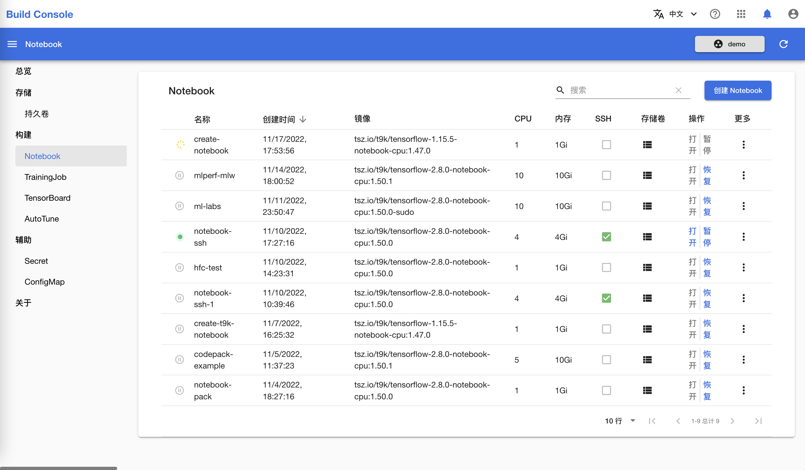
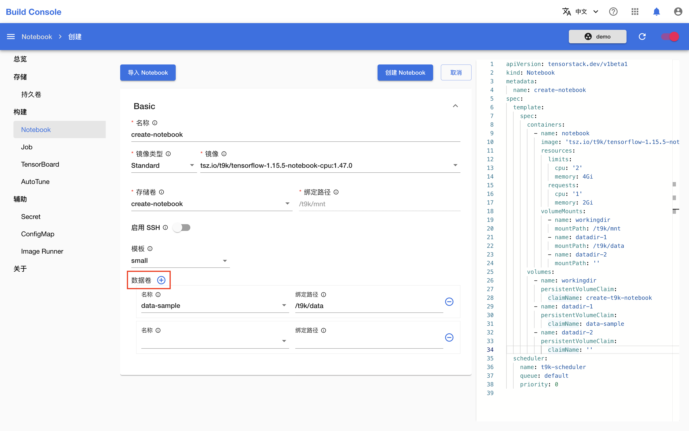

# 创建 Notebook

本教程演示如何创建 Notebook。

## 创建持久卷申领

创建 Notebook 时，需要至少绑定一个持久卷申领来存储代码、数据等文件。如果您的项目中已有合适的持久卷，则可以跳过这一部分。

在模型构建控制台的左侧导航菜单中点击**存储 > 持久卷** 进入持久卷申领（PersistentVolumeClaim）管理页面。然后点击右上角的**创建 PersistentVolumeClaim** 进入创建页面：

在持久卷申领创建页面，**名称**填写 `create-notebook`，其他参数保持默认值，然后点击**创建 PersistentVolumeClaim** 进行创建：

## 创建标准的 Notebook

在模型构建控制台的左侧导航菜单中点击**构建 > Notebook** 进入 Notebook 管理页面，然后点击右上角的**创建 Notebook** 进入创建页面：

在 Notebook 创建页面，如下填写各个参数：

* **名称**填写 `create-notebook`。
* **镜像**根据您想使用的机器学习框架（如 TensorFlow、PyTorch 等）及其版本选择一个标准 Notebook 镜像。
* **存储卷**选择上一节创建的 `create-notebook`（或其他合适的存储卷）。存储卷会被挂载到 Notebook 的 `/t9k/mnt` 目录下。
* **模板**选择 `small`。

其他参数保持默认值。完成之后，点击**创建 Notebook** 进行创建。

回到 Notebook 管理页面查看新创建的 Notebook：

如果 Notebook 被分配到的节点中已经有了对应的 Notebook 镜像，那么 Notebook 通常能在 10 秒内运行；否则，可能需要几分钟来拉取镜像。Notebook 运行后，您可以[使用 Notebook](./use-notebook.md)。

### 添加额外的存储卷

可以为 Notebook 绑定额外的数据卷。如下图所示：

每绑定一个数据卷需要填写如下参数：

* `名称`：使用的持久卷名称。
* `绑定路径`：将持久卷绑定到 Notebook 的指定路径下。

在上图的示例中，我们将持久卷 `data-sample` 绑定到了 Notebook 的 `/t9k/data` 路径下。您可以在 Notebook 中通过对应路径访问持久卷中的数据。
