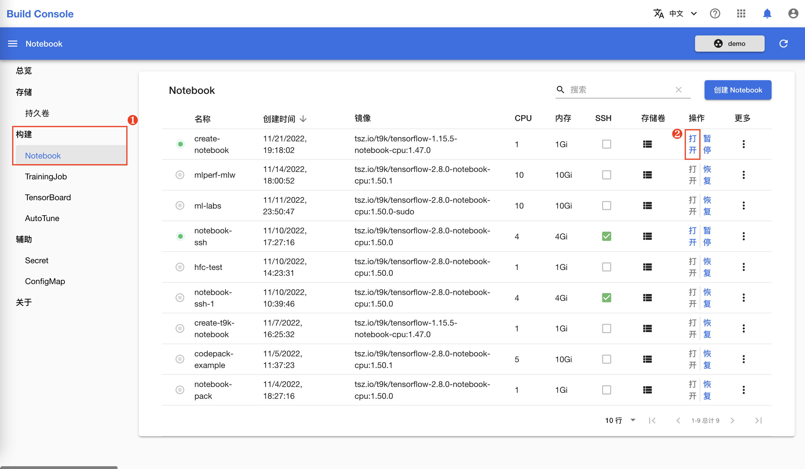
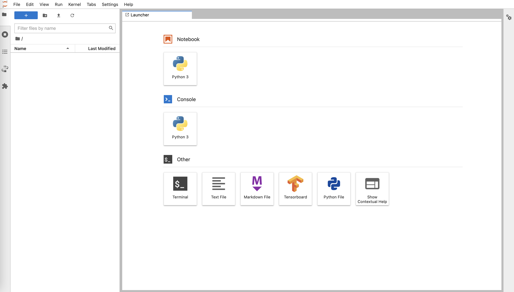
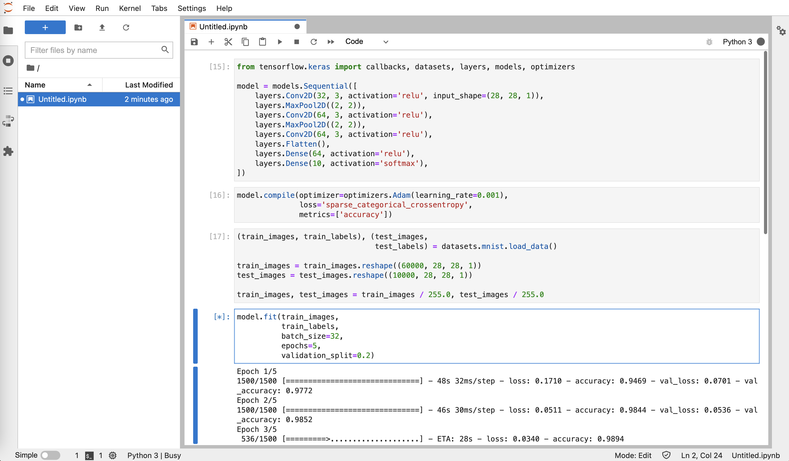
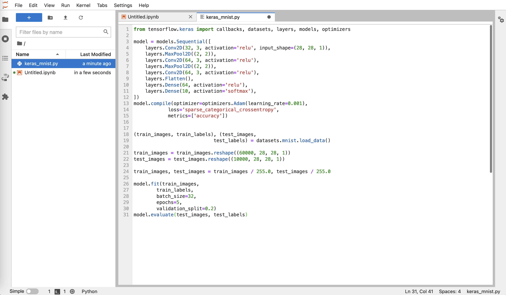
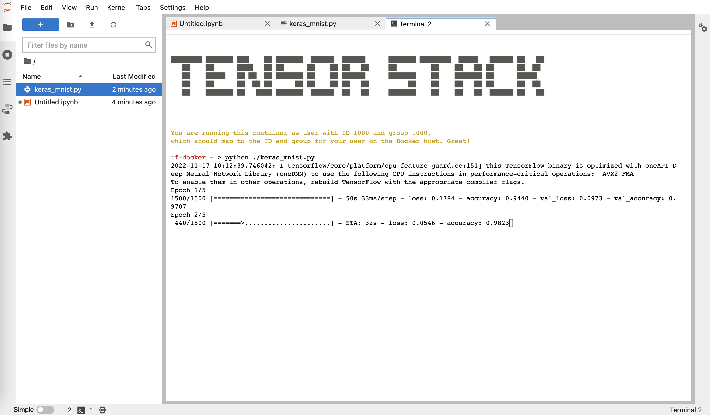

# 使用 Notebook

本教程演示如何使用 Notebook 进行模型开发相关的工作。

## 打开 JupyterLab

在模型构建控制台的左侧导航菜单中点击**构建 > Notebook** 进入 Notebook 管理页面，然后点击运行中的 Notebook 右侧的**打开**：

> 如果 Notebook 处于暂停状态，那么您需要先点击右侧的**恢复**，等待 Notebook 运行后再使用。
> TensorStack AI 平台会自动暂停长时间闲置的 Notebook 以释放集群资源，您也可以主动暂停 Notebook。



进入到 [JupyterLab](https://jupyter.org/) 的页面：



## 使用 Jupyter Notebook

点击 **Launcher** 标签页下，**Notebook** 下方的 **Python3** 图标以创建 Jupyter Notebook：


Jupyter Notebook 提供了交互式的 Python 开发环境。您可以在这里分块编辑并运行 Python 代码。比如运行 `keras_mnist.py`：

``` python
from tensorflow.keras import callbacks, datasets, layers, models, optimizers

model = models.Sequential([
    layers.Conv2D(32, 3, activation='relu', input_shape=(28, 28, 1)),
    layers.MaxPool2D((2, 2)),
    layers.Conv2D(64, 3, activation='relu'),
    layers.MaxPool2D((2, 2)),
    layers.Conv2D(64, 3, activation='relu'),
    layers.Flatten(),
    layers.Dense(64, activation='relu'),
    layers.Dense(10, activation='softmax'),
])
model.compile(optimizer=optimizers.Adam(learning_rate=0.001),
            loss='sparse_categorical_crossentropy',
            metrics=['accuracy'])


(train_images, train_labels), (test_images,
                            test_labels) = datasets.mnist.load_data()

train_images = train_images.reshape((60000, 28, 28, 1))
test_images = test_images.reshape((10000, 28, 28, 1))

train_images, test_images = train_images / 255.0, test_images / 255.0

model.fit(train_images,
        train_labels,
        batch_size=32,
        epochs=5,
        validation_split=0.2)
model.evaluate(test_images, test_labels)
```



## 编辑文件

在左侧的文件系统导航菜单空白处右击，可以创建文件和目录：


创建名为 `keras_mnist.py` 的文件，双击以进行编辑。复制上文中 `keras_mnist.py` 的内容，粘贴在文本编辑器中并保存：



## 使用 Terminal

点击左上角蓝色底色的 **+** 符号打开新的 **Launcher** 标签页，然后点击 **Other** 中的 **Terminal** 进入命令行终端。您可以在这里运行各种 bash 命令，例如运行 `python ./keras_mnist.py` 来进行模型训练：


